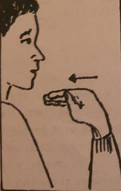
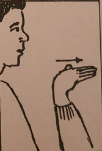
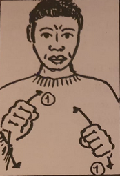
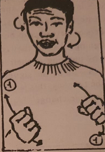

# HEARING IMPAIRMENT, DEAFNESS AND SIGN LANGUAGE

A HEARING impaired person is one suffering any degree of hearing loss, compared to normal hearing. The hearing loss can range from mild
to very profound. The term deaf is reserved to describe persons with sever to profound hearing losses.

Deafness can be defined in two ways: the medical/functional and the cultural.

The medical/functional definition sees a deaf person as one whose hearing impairment is so severe that even with the help of good
amplification will still be dependent on his vision rather than on his auditory perception to be able to process langage.

It is important, however, to distinguish betwen prelingual and postlingual deafness. A prelingual deaf person is, on the one hand, one who was
born deaf or who went deaf before acquiring a spoken language. This person cannot acquire spoken language normally and will require
alternative modes of communication - visual - to process language.

A postlingual deaf person is, on the other hand, one who becomes deaf after acquiring a spoken language and who therefore may be able,
partially, to maintain and use this already acquired language in his future communication.

The cultural definition of deafness views a deaf person as one who identifies oneself with other deaf people through close interaction with
them, using the deaf community's sign language as the natural medium of communication.

The actual number of hearing impaired persons in Kenya is not known, but the World Health Organization estimates that about
1% of the population is hearing impaired; that is, it has some hearing loss of varying degree and severity. Out of this number
of hearing impaired people, approximately 4% are considered to be deaf.

SOme of the major causes of deafness are heredity, prematurity, such infections as rubella of the mother during pregnancy, physical
abnormalities, traumas to the skull or the ear, use of certain ototoxic drugs and degeneration of cells due to old age.

Certain kinds of hearing losses can sometimes be corrected by surgery. These are hearing losses known as conductive losses,
caused by obstruction or diseases of any kind in the outer or middle ear. Hearing losses known as sensory-neural losses (or perceptive losses)
which result in the damage of the delicate sensory cells of the inner ear, the auditory nerve or the auditory centre in the brain,
are usually not possible to correct through surgery.

The use of hearing aids may benefit some hearing impaired people by lifting speech sounds. However, other hearing impaired people will 
never, no matter the degree of amplification through the hearing aid, be able to interpret sounds reaching their ears the same way as hearing
people do. This is because those sounds will continuously be experienced as distoreted due to the damage of the inner ear.

Deaf people normally communicate in the medium easily accessible to them. The visual/ gestural sign language of their culture.
The sign language is called visual because it is received through vision, that is the eye and not the ear and gestural as it is produced by
gestures and not by voice.

In Kenya, deaf people have developed Kenyan Sign Language (KSL) as their own national sign language, which is very different from
the American Sign Language (ASL), British Sign Language (BSL), or any other national sign language. However, KSL is as valid as any other
sign language for communication.

Sign language is the native language of the deaf, created by them to be used for communication among themselves and with others.
Within deaf families, this language is learnt as a first language, going through the developmental stages the same way a spoken  language is
learned by the hearing child in a hearing/speaking family. Only a small percentage of deaf children are born into deaf families, while the
majority are born into hearing families. These deaf children learn their national sign language concurrently with their hearing parents;
that is, learn the sign language as their parents acquire it or later in school when associating with deaf children of deaf parents.

A sign language is expressed through the use of signs, including body movements and facial expressions, in a specific grammatical manner.
Signs have much the same functions in a sign language as words have in a spoken language. Thus, words are comprised of units which work
together in a unique way to make each word different from any other word like: mat > < hat. If “m’’ is replaced by ‘‘h’’, the meaning of
the word will change. In the same way, signs are composed of four units, which together make each sign different from the other.
These four units are:

— handshape      e.g.: The fist, an out- stretched index finger etc.

— location       The position of the hand in relation to the body: on the side of the head, at the throat, on the chest etc.

— movement       direction and speed of the movement of the hands, e.g.: slowly from the forehead to the chin,
                 fast from side to side in front of the chest, etc.
— orientation    how the handshape is oriented, e.g.; inwards towards the body, outwards towards the listener etc.

If one of these four units is changed, the meaning of the sign is also changed.

The individual signs are put together into sentences by applying the visual/ spatial grammatical rules of sign language.
There are many visual grammatical rules but suffice it to mention only two below:

## (a) Use of Space

The space in front of the speaker is used to create an imaginary scene on which objects or persons can be placed through signing.
Later, they can be referred to by pointing to their already located places — or by the signer taking the role of the persons;
this latter use of space is called role-change.
Through this use of space, grammatical features as subject, object and indirect object, among others, can be expressed.

## (b) Inflection of Verbs

Certain verbs, like ‘ASK’ can be inflexed in several ways; two of which
are mentioned here:

### 1. manner of direction as:

<table>
  <tr>
    <td>
      <figure>
        
        <figcaption>YOU - ASK - ME</figcaption>
      </figure>
    </td>
    <td>
      <figure>
        
        <figcaption>I - ASK - YOU</figcaption>
      </figure>
  </tr>
</table>

Thus indicating subject and object. They can also be inflexed in a

### 2. manner of performance as:
2. manner of performance as:

<table>
  <tr>
    <td>
      <figure>
        
        <figcaption>**I-DRIVE - CAREFULLY**</figcaption>
      </figure>
    </td>
    <td>
      <figure>
        
        <figcaption>**I-DRIVE - CARELESSLY**</figcaption>
      </figure>
  </tr>
</table>

In the example I - DRIVE - CARE- LESSLY, the sign ‘DRIVE’ is simultaneously combined with a lazy, relaxed body posture and
facial expression with the head moving slowly from side to side whereas in the example I - DRIVE - CAREFULLY, “DRIVE” is simultaneously
combined with a tense body posture and tense facial expression.

If a parent, teacher or friend, of the deaf wants to learn sign language, he will have to go where the deaf people meet and interact
with them. However, when hearing and deaf people meet, a combination of communication approaches is often seen, created to surpass
the barrier between these two very different languages.
